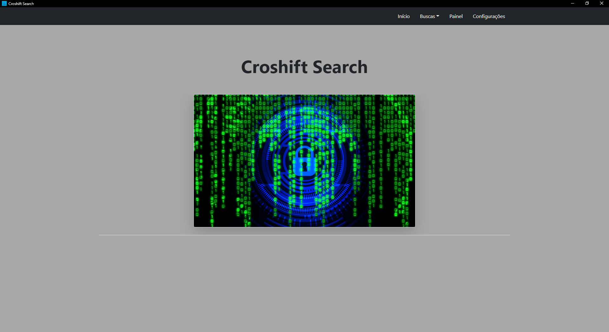

# Croshift-Search
A Croshift Search é um software baseado em API, que tem como função realizar atividades em específicas, como, realizar a resolução de um DNS, busca por uma gama de IPS utilizando uma rede ou CDIR(Inter-Domain Routing), realiza a reversão de um DNS, busca por domínios e informações referente a um determinado IP. Toda estrutura de dados é recuperada de uma API disponibilizada para usuários do Shodan, sejam eles estudantes ou enterprise. 

Croshift Search é um software desenvolvido em prol de um certificado do curso de Python da ITSafe(Cysource): https://cysource.com.br/cyber_full#python